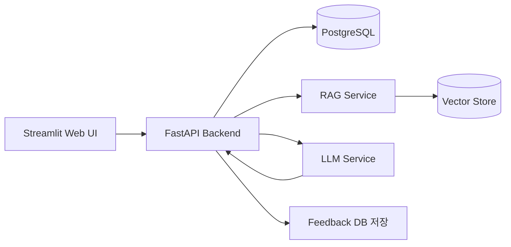

## 10. 아키텍처 설계

### 핵심 질문

> 이 시스템을 어떤 구조로 만들면 이해하기 쉽고 확장 가능한가?
> 

### 전체 아키텍처



### MVP 아키텍처 설명

Streamlit은 강사용 웹 화면입니다.

FastAPI는 백엔드 서버입니다. 아이 등록, 프로필 카드 수정, 수업 기록 저장, 피드백 생성, 이력 조회 API를 제공합니다.

PostgreSQL은 아이 정보, 프로필 카드, 수업 기록, 생성된 피드백을 저장합니다.

RAG Service는 지도 가이드 문서를 검색합니다. 초기에는 Chroma를 쓰고, 시간이 남으면 pgVector로 바꿀 수 있습니다.

LLM Service는 프롬프트를 구성하고 LLM API를 호출합니다.

### 폴더 구조

```
jump-feedback-system/
│
├── backend/
│   ├── app/
│   │   ├── main.py
│   │   ├── core/
│   │   │   ├── config.py
│   │   │   └── database.py
│   │   ├── models/
│   │   │   ├── child.py
│   │   │   ├── lesson_record.py
│   │   │   ├── feedback.py
│   │   │   └── rag_document.py
│   │   ├── schemas/
│   │   │   ├── child_schema.py
│   │   │   ├── lesson_schema.py
│   │   │   └── feedback_schema.py
│   │   ├── routers/
│   │   │   ├── children_router.py
│   │   │   ├── lessons_router.py
│   │   │   ├── feedbacks_router.py
│   │   │   └── rag_router.py
│   │   ├── services/
│   │   │   ├── feedback_service.py
│   │   │   ├── prompt_service.py
│   │   │   ├── llm_service.py
│   │   │   └── rag_service.py
│   │   └── repositories/
│   │       ├── child_repository.py
│   │       ├── lesson_repository.py
│   │       └── feedback_repository.py
│
├── frontend/
│   └── streamlit_app.py
│
├── rag_docs/
│   ├── jump_rope_level_guide.md
│   ├── emotional_support_guide.md
│   ├── parent_feedback_rule.md
│   ├── teacher_coaching_rule.md
│   └── material_check_guide.md
│
├── evals/
│   ├── test_cases.json
│   └── run_eval.py
│
├── docker-compose.yml
├── README.md
└── .env.example