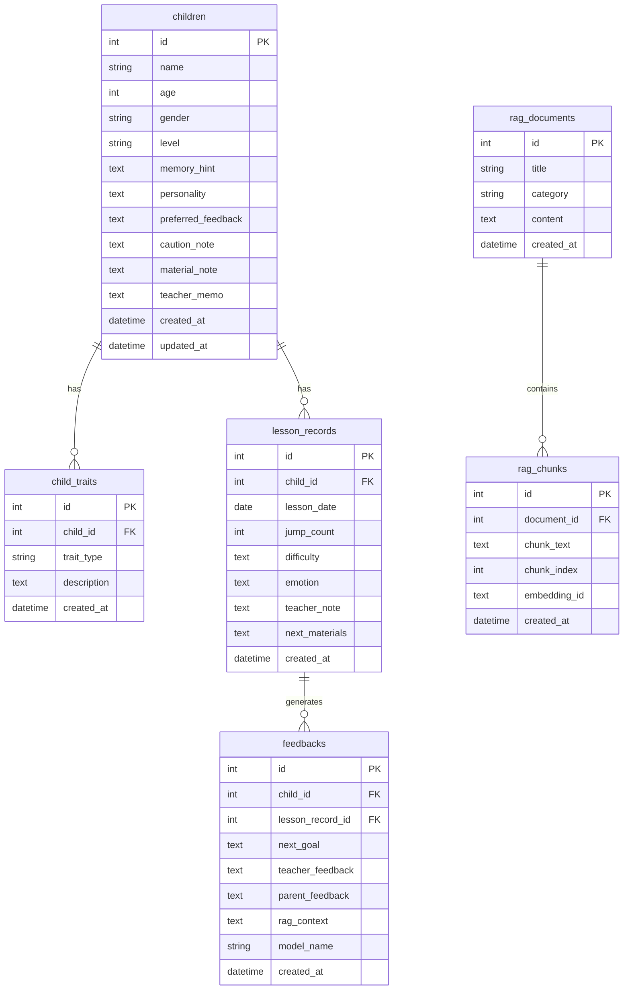

## 11. 데이터 모델

### ERD



### children 테이블 필드

```
id
name
age
gender
level
memory_hint
personality
preferred_feedback
caution_note
material_note
teacher_memo
created_at
updated_at
```

### 필드 설명

```
memory_hint:
아이 이름을 기억하기 위한 외형/행동/상황 단서

personality:
수업 중 보이는 성향

preferred_feedback:
잘 반응하는 칭찬 방식

caution_note:
주의해야 할 표현이나 상황

material_note:
준비물 관련 특이사항

teacher_memo:
강사용 자유 메모
```

## 12. API 설계

| Method | Endpoint | 기능 |
| --- | --- | --- |
| GET | `/health` | 서버 상태 |
| POST | `/children` | 아이 등록 |
| GET | `/children` | 아이 목록 |
| GET | `/children/{id}` | 아이 상세 |
| PATCH | `/children/{id}` | 프로필 수정 |
| POST | `/lesson-records` | 수업 기록 |
| GET | `/children/{id}/lesson-records` | 기록 조회 |
| POST | `/feedbacks/generate` | 피드백 생성 |
| GET | `/children/{id}/feedbacks` | 피드백 이력 |
| POST | `/rag/documents` | 문서 등록 |
| POST | `/rag/index` | 문서 인덱싱 |
| GET | `/rag/search` | RAG 검색 |

### POST `/children` 예시

```json
{
  "name": "민준",
  "age": 7,
  "gender": "남",
  "level": "초급",
  "memory_hint": "파란 줄넘기를 들고 오고, 성공하면 양손을 들고 좋아함",
  "personality": "처음에는 조심스럽지만 칭찬을 받으면 적극적으로 도전함",
  "preferred_feedback": "개수보다 시도한 점을 칭찬해주면 좋음",
  "caution_note": "실패를 반복하면 금방 위축될 수 있음",
  "material_note": "개인 줄넘기를 자주 깜빡함",
  "teacher_memo": "처음 목표는 낮게 잡고 성공 경험을 먼저 제공"
}
```