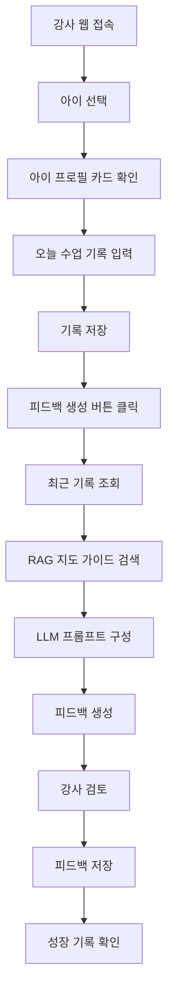
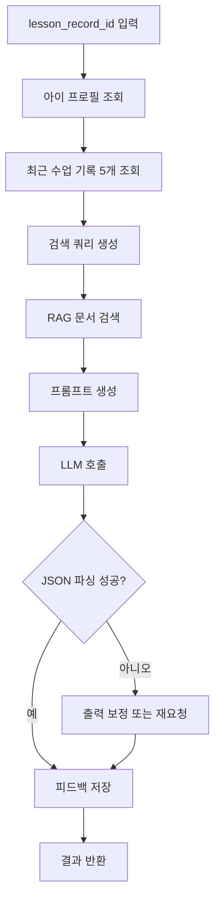
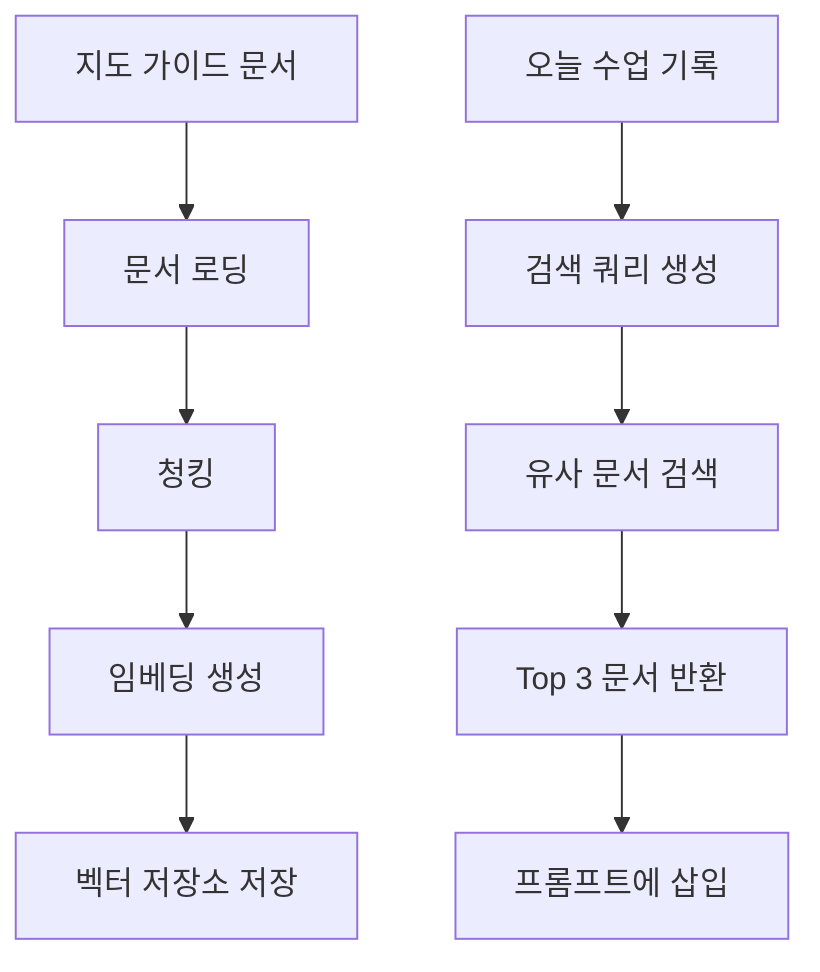

### 시나리오 4: 성장 기록 확인

강사는 아이별 과거 기록과 피드백 이력을 확인합니다. Streamlit 화면에서는 줄넘기 개수 변화 그래프를 보여줍니다.

### 사용자 플로우



### AI 워크플로우



### RAG 워크플로우



### 예외 처리 흐름

### RAG 검색 실패

```
RAG 검색 결과 없음
→ 기본 프롬프트로 생성
→ rag_context = null 저장
```

### LLM 실패

```
LLM API 호출 실패
→ 1회 재시도
→ 2회 실패 시 안내 메시지 반환
```

### 위험 표현 감지

금지 표현 예시:

```
뒤처짐
문제 있음
운동 능력이 낮음
집중력이 부족함
다른 아이들보다
```


